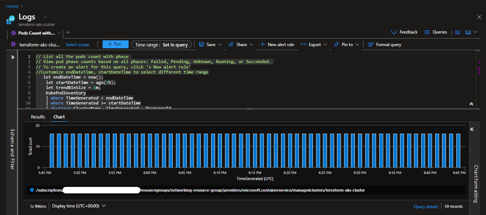
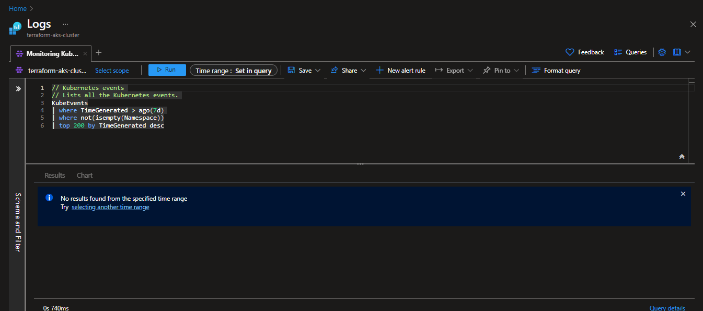

<a id="readme-top"></a>

# Web-App-DevOps-Project

Welcome to the Web App DevOps Project repo! This application allows you to efficiently manage and track orders for a potential business. It provides an intuitive user interface for viewing existing orders and adding new ones.

## Table of Contents

- [Features](#features)
- [Getting Started](#getting-started)
- [Technology Stack](#technology-stack)
- [Architecture](#architecture)
- [Creating an Azure End-to-End DevOps Pipeline](#creating-an-azure-end-to-end-devops-pipeline)
  - [Containerisation Process using Docker](#containerisation-process-using-docker)
  - [Defining Networking Services with IaC using Terraform](#defining-networking-services-with-iac-using-terraform)
  - [Defining an AKS Cluster with IaC using Terraform](#defining-an-aks-cluster-with-iac-using-terraform)
  - [Creating an AKS Cluster with IaC using Terraform](#creating-an-aks-cluster-with-iac-using-terraform)
  - [Kubernetes Deployment to AKS](#kubernetes-deployment-to-aks)
  - [CI/CD Pipeline with Azure DevOps](#cicd-pipeline-with-azure-devops)
  - [AKS Cluster Monitoring](#aks-cluster-monitoring)
  - [AKS Integration with Azure Key Vault for Secrets Management](#aks-integration-with-azure-key-vault-for-secrets-management)
- [Contributors](#contributors)
- [License](#license)

## Features

- **Order List:** View a comprehensive list of orders including details like date UUID, user ID, card number, store code, product code, product quantity, order date, and shipping date.

  

- **Pagination:** Easily navigate through multiple pages of orders using the built-in pagination feature.

  

- **Add New Order:** Fill out a user-friendly form to add new orders to the system with necessary information.

   <p>
   
   </p>

- **Data Validation:** Ensure data accuracy and completeness with required fields, date restrictions, and card number validation.

### Enhancements

- **Adding a Delivery Date Column to Order List:**

   <table style="border-style:solid;border-width:thin;border-left-width:thick;">
   <tr><th>📝 NOTE</th></tr>
   <tr><td>This feature was requested and then reverted. See <a href="https://github.com/SophiaKaterinis/Web-App-DevOps-Project/issues/1">issue #1</a></td></tr> 
   </table>

- <details>
  <summary>If requested again, follow these instructions:</summary>

  1.  In `app.py` modify the following:

      a. `Order` class to include `delivery_date = Column('Delivery Date', DateTime)`

      b. `@app.route` `add_order` function to include `delivery_date = request.form['delivery_date']`

      c. `new_order` object to include `delivery_date=delivery_date`

  2.  In `order.html` modify the following:

      a. `<th>` elements to include `<th>Delivery Date</th>`

      b. `<td>` elements to include `<td>{{ order.delivery_date }}</td>`

      c. `<form>` element to include `<label for="delivery_date">Delivery Date:</label>` and `<input type="date" id="delivery_date" name="delivery_date"><br><br>`

  </details>

<p>
  <a href="#readme-top">back to top</a>
</p>

## Getting Started

### Prerequisites

For the application to succesfully run, you need to install the following packages:

> [!IMPORTANT]
> It is recommended that you create and activate a conda environment prior to installing.

- flask (version 2.2.2)
- pyodbc (version 4.0.39)
- SQLAlchemy (version 2.0.21)
- werkzeug (version 2.2.3)

### Usage

To run the application, you simply need to run the `app.py` script in this repository. Once the application starts you should be able to access it locally at http://127.0.0.1:5000. Here you will be meet with the following two pages:

1. **Order List Page:** Navigate to the "Order List" page to view all existing orders. Use the pagination controls to navigate between pages.

2. **Add New Order Page:** Click on the "Add New Order" tab to access the order form. Complete all required fields and ensure that your entries meet the specified criteria.

<p>
  <a href="#readme-top">back to top</a>
</p>

## Technology Stack

- **Backend:** Flask is used to build the backend of the application, handling routing, data processing, and interactions with the database.

- **Frontend:** The user interface is designed using HTML, CSS, and JavaScript to ensure a smooth and intuitive user experience.

- **Database:** The application employs an Azure SQL Database as its database system to store order-related data.

- **Deployment:**
  - **Containerisation:** This application uses Docker for containerisation to offer a flexible and consistent deployment solution.
  - **Distribution:** This application uses Docker Hub for distribution.
  - **Infrastructure as Code (IaC):** This application uses Terraform for IaC.
  - **Deployment automation, scaling, and management of containerised application:** This application uses Kubernetes (K8s) for deployment automation, scaling, and management of containerisation.

<p>
  <a href="#readme-top">back to top</a>
</p>

## Architecture


<p>
  <a href="#readme-top">back to top</a>
</p>

## Creating an Azure End-to-End DevOps Pipeline

> [!IMPORTANT]
>
> - You'll need to install: [Docker](https://docs.docker.com/get-docker/), [Terraform](https://developer.hashicorp.com/terraform/install), [Azure CLI](https://learn.microsoft.com/en-us/cli/azure/install-azure-cli), [Kubernetes](https://kubernetes.io/releases/download/).
> - You'll also need accounts for: [Docker Hub](https://hub.docker.com/), [Azure](https://portal.azure.com/#home), [Azure DevOps](https://learn.microsoft.com/en-us/azure/devops/?view=azure-devops), [GitHub](https://github.com/).

### Containerisation Process using Docker

1. <details>
   <summary>Create <code>Dockerfile</code></summary>

   - **Base Image Selection:** Choose an official Python runtime as the parent image such as `python:3.8-slim`
   - **Set the Working Directory:** Use `WORKDIR` and set it to `/app`
   - **Copy Application Files:** Use `COPY` and copy all contents of local directory to `/app`
   - **Install Python Packages from `requirements.txt`:**
     Use the command
     ```
     pip install --trusted-host pypi.python.org -r requirements.txt
     ```
   - **Expose Port 5000:** To allow access to the Flask application outside the container.
   - **Define Startup Command:** Use `CMD` to specify the command to be executed when the container launches.

   </details>

2. <details>
   <summary>Build Docker Image</summary>

   - `docker build -t <name of the image> .`

   </details>

3. <details>
   <summary>Run Docker Container Locally</summary>

   - `docker run -p 5000:5000 <name of the image>`
   - Go to http://127.0.0.1:5000 to view the application within the Docker container.

   </details>

4. <details>
   <summary>Tag and Push to Docker Hub</summary>

   - Use the following format:
     ```
     docker tag <name of the image> <docker-hub-username>/<image-name>:<tag>
     ```
   - Login to your [Docker Hub](https://hub.docker.com/) account and use `docker push` to upload the Docker image

   </details>

5. <details>
   <summary>Verify image on Docker Hub</summary>

   To validate the presence and accessibility of the Docker image on Docker Hub:

   - Confirm the Docker image is listed within the repository.
   - Test access by pulling image to local development envirionment.

   </details>

### Defining Networking Services with IaC using Terraform

1. <details>
   <summary>Create Terraform Project and Modules</summary>

   - Name the Terraform project `aks-terraform` and initialise it
   - Organize the project into two Terraform modules:
     - `networking-module` for provisioning the necessary Azure Networking Services for an AKS cluster
     - `aks-cluster-module` for provisioning the Kubernetes cluster itself

   </details>

2. <details>
   <summary>Define the Networking Module Input Variables</summary>

   Inside the `networking-module` directory create a `variables.tf` file.

   Input variables:

   - `resource_group_name`: the name of the Azure Resource Group where the networking resources will be deployed in. It is of type `string` and has a `default` value.
   - `location`: the Azure region where the networking resources will be deployed to. It is of type `string` and has a `default` value.
   - `vnet_address_space`: the address space for the Virtual Network (VNet) that will be created later in the main configuration file of this module. It is of type `list(string)` and has a `default` value.

   </details>

3. <details>
   <summary>Define Networking Resources and NSG Rules</summary>

   Inside the `networking-module`'s `main.tf` file, define the essential networking resources for an AKS cluster.

   - **Azure Resource Group:** reference the `resource_group_name`
   - **Virtual Network (VNet):** `aks-vnet`
   - **Control Plane Subnet:** `control-plane-subnet`
   - **Worker Node Subnet:** `worker-node-subnet`
   - **Network Security Group (NSG):** `aks-nsg`
     - `kube-apiserver-rule`: allows inbound traffic from your public IP address to `kube-apiserver`
     - `ssh-rule`: allows inbound SSH traffic from your public IP address

   </details>

4. <details>
   <summary>Define the Networking Module Output Variables</summary>

   Inside the `networking-module` directory create a `outputs.tf` file.

   Output variables:

   - `vnet_id`: Will be used within the cluster module to connect the cluster to the defined VNet.
   - `control_plane_subnet_id`: Control plane subnet ID within the VNet. Will be used to specify the subnet where the control plane components of the AKS cluster will be deployed to.
   - `worker_node_subnet_id`: Worker node subnet ID within the VNet. Will be used to specify the subnet where the worker nodes of the AKS cluster will be deployed to.
   - `networking_resource_group_name`: The Azure Resource Group name where the networking resources were provisioned in. Will be used to ensure the cluster module resources are provisioned within the same resource group.
   - `aks_nsg_id`: Will be used to associate the NSG with the AKS cluster for security rule enforcement and traffic filtering.

   </details>

5. <details>
   <summary>Initialise the Networking Module</summary>

   - `cd` into `networking-module` and run the initialisiation command `terraform init`

   </details>

### Defining an AKS Cluster with IaC using Terraform

1. <details>
   <summary>Define the Cluster Module Input Variables</summary>

   Inside the `cluster-module` directory create a `variables.tf` file.

   Input variables of type `string` with a `default` value:

   - `aks_cluster_name`: the name of the AKS Cluster to create.
   - `cluster_location`: the Azure region where the AKS cluster will be deployed to.
   - `dns_prefix`: defines the DNS prefix of the AKS cluster.
   - `kubernetes_version`: specifies which Kubernetes version the AKS cluster will use.
   - `service_principal_client_id`: provides the Client ID for the service principal associated with the AKS cluster.
   - `service_principal_secret`: supplies the Client Secret for the service principal.

   Add the Output variables from `networking-module`:

   - `resource_group_name`
   - `vnet_id`
   - `control_plane_subnet_id`
   - `worker_node_subnet_id`

   </details>

2. <details>
   <summary>Define the Cluster Resources</summary>

   Inside the `cluster-module`'s `main.tf` file, define the necessary Azure resources for provisioning an AKS cluster. Use the input variables to specify the necessary arguments.

   - Create the AKS cluster
   - Specify the node pool
   - Specify the service principle

   </details>

3. <details>
   <summary>Define the Cluster Module Output Variables</summary>

   Inside the `cluster-module` directory create a `outputs.tf` file.

   Output variables:

   - `aks_cluster_name`: The provisioned cluster.
   - `aks_cluster_id`: Cluster ID.
   - `aks_kubeconfig`: Captures the Kubernetes configuration file of the cluster. This file is essential for interacting with and managing the AKS cluster using `kubectl`.

   </details>

4. <details>
   <summary>Initialise the Cluster Module</summary>

   - `cd` into `aks-cluster-module` and run the initialisiation command `terraform init`

   </details>

### Creating an AKS Cluster with IaC using Terraform

1.  <details>
    <summary>Define the Project Main Configuration</summary>

    Inside the main project directory `aks-terraform` create a `main.tf` file.

    Define the Azure `provider` block to enable authentication to Azure using your service principal credentials.

    - To get your service principal credentials:
      - Open your terminal and sign in to [Azure](https://portal.azure.com/#home) using the [Azure CLI](https://learn.microsoft.com/en-us/cli/azure/install-azure-cli) command: `az login`.
      - Follow the prompts to authenticate with your Azure account.
      - Once you are logged in, list your Azure subscriptions and their details using the following command: `az account list --output table`. This command will display a table with information about your Azure subscriptions. Look for the `SubscriptionId` column to find your subscription ID.
    - To create a Service Principal use the command:
      ```
      az ad sp create-for-rbac --name <your-app-name> --role contributor --scopes /subscriptions/<your-subscription-id>/resourceGroups/<your-resource-group-name>
      ```

    </details>

2.  <details>
    <summary>Integrate the Networking Module</summary>

    - Set `resource_group_name` to a descriptive name, such as `networking-resource-group`
    - Set `location` to an Azure region that is geographically close to you to improve latency (e.g. `"UK South"`)
    - Set `vnet_address_space` to `["10.0.0.0/16"]`

    </details>

3.  <details>
    <summary>Integrate the Cluster Module</summary>
       
     - Set `cluster_name` to `terraform-aks-cluster`
     - Set `location` to an Azure region that is geographically close to you to improve latency (e.g. `"UK South"`)
     - Set `dns_prefix` to `myaks-project`
     - Set `service_principal_client_id`and `service_principal_secret` to your service principal credentials
     - Use variables referencing the output variables from the networking module for the other input variables required by the cluster module such as: `resource_group_name`, `vnet_id`, `control_plane_subnet_id`, `worker_node_subnet_id` and `aks_nsg_id`
     
     </details>

4.  <details>
    <summary>Apply the Main Project Configuration</summary>
       
    - **Initialise the main project:** `cd` into `aks-terraform` and run the initialisiation command `terraform init`
    - **Review configuration & plan deployment:** `terraform plan`
       <table style="border-style:solid;border-width:thin;border-left-width:thick;">
       <tr><th>❗ IMPORTANT</th></tr>
       <tr><td>If you have sensitive or secret input variables stored in a <code>*.tfvars</code> file, use the command:</td></tr> 
       </table>
       
       ```
       terraform plan -var-file="<your-secret-file-name>.tfvars"
       ```

    - **Apply the Terraform configuration:** `terraform apply`
      <table style="border-style:solid;border-width:thin;border-left-width:thick;">
      <tr><th>❗ IMPORTANT</th></tr>
      <tr><td>If you have sensitive or secret input variables stored in a <code>*.tfvars</code> file, use the command:</td></tr> 
      </table>

      ```
      terraform apply -var-file="<your-secret-file-name>.tfvars"
      ```

     </details>

5.  <details>
    <summary>Access the AKS Cluster</summary>

    - Retreive the `kubeconfig` file once the AKS cluster has been provisioned.

      - Use the command:

      ```
      az aks get-credentials --resource-group <your-resource-group> --name <your-aks-cluster-name>
      ```

      <table style="border-style:solid;border-width:thin;border-left-width:thick;">
      <tr><th>❗ IMPORTANT</th></tr>
      <tr><td>If you use <code>wsl</code> on Windows and you’ve set up the kubectl tool as part of your Docker installation, Docker needs to be running for <code>kubectl</code> commands to work.</td></tr> 
      </table>

      </details>

### Kubernetes Deployment to AKS

1. <details>
   <summary>Kubernetes Manifest Definition - Deployment</summary>

   Create a Kubernetes Manifest file `application-manifest.yaml`

   - Define a Deployment named `flask-app-deployment` that acts as a central reference for managing the containerized application.
   - Specify that the application should concurrently run on two replicas within the AKS cluster, allowing for scalability and high availability.
   - Within the `selector` field, use the `matchLabels` section to define a label that uniquely identifies your application. For example, you could use the label `app: flask-app`. This label will allow Kubernetes to identify which pods the Deployment should manage.
   - In the `metadata` section, define `labels` for the pod `template`. Reiterate the use of the label `app: flask-app`. This label is used to mark the pods created by the Deployment, establishing a clear connection between the pods and the application being managed.
   - Configure the manifest to point to the specific container housing the application, which should be already hosted on [Docker Hub](https://hub.docker.com/). This ensures that the correct container image is utilised for deployment.
   - Expose port `5000` for communication within the AKS cluster. This port servers as the gateway for accessing the application's user interface, as defined in the application code.
   - Implement the `RollingUpdate` deployment strategy, facilitating seamless application updates. Ensure that, during updates, a maximum of one pod deploys while one pod becomes temporarily unavailable, maintaining application availability.

   </details>

2. <details>
   <summary>Kubernetes Manifest Definition - Service</summary>

   Add a Kubernetes Service manifest to the existing file `application-manifest.yaml` to facilitate internal communication within the AKS cluster.

   - Define a service named `flask-app-service` to act as a reference for routing internal communication
   - Ensure that the selector matches the labels (`app: flask-app`) of the previously defined pods in the Deployment manifest. This alignment guarantees that the traffic is efficiently directed to the appropriate pods, maintaining seamless internal communication within the AKS cluster.
   - Configure the service to use `TCP` protocol on `port: 80` for internal communication within the cluster. The `targetPort` should be set to `5000`, which corresponds to the port exposed by your container.
   - Set the service type to `ClusterIP`, designating it as an internal service within the AKS cluster.

   </details>

3. <details>
   <summary>Deploying Kubernetes Manifest to AKS</summary>

   - Before deploying the Kubernetes manifests to your AKS cluster, make ensure you are in the correct context, which in this case is the Terraform-provisioned AKS cluster. The context specifies the cluster and user details for your AKS cluster, ensuring the deployment occurs in the intended environment.

     - Use the command `kubectl config get-contexts`

   - Once you have ensured that the correct context is set, proceed with the deployment of the Kubernetes manifests. Apply the manifest and monitor the command-line interface for feedback on the deployment process.

     - `cd` to the root directory of your project and use the command:

     ```
     kubectl apply -f application-manifest.yaml
     ```

   - After the deployment has successfully completed, take a moment to verify the status and details of the deployed pods and services. This step ensures that they are running as expected and confirm the reliability of the deployment.

     - Run the following commands:
       - `kubectl get deployments`
       - `kubectl get pods`
       - `kubectl get services`

    </details>

4. <details>
    <summary>Testing and Validating Deployments on AKS</summary>

   The application we've been developing is an internal tool designed for the company's employees and is not intended for external users. Given its internal nature, you can efficiently assess the deployment by performing port forwarding to a local machine. Here are the steps to follow:

   - Start by verifying the status and details of your pods and services within the AKS cluster. Ensure that the pods are running, and the services are correctly exposed within the cluster.

     - Run the following commands:
       - `kubectl get deployments`
       - `kubectl get pods`
       - `kubectl get services`
       - `kubectl cluster-info`

   - Once you've confirmed the health of your pods and services, initiate port forwarding using the `kubectl port-forward <pod-name> 5000:5000` command. Replace `<pod-name>` with the actual name of the pod you want to connect to. This command establishes a secure channel to your application, allowing you to interact with it locally.

   - With port forwarding in place, your web application hosted within the AKS cluster can be accessed locally at http://127.0.0.1:5000

   - Visit this local address and thoroughly test the functionality of your web application. Pay particular attention to the orders table, ensuring that it is displayed correctly and that you can successfully use the `Add Order` functionality.

  </details>

### CI/CD Pipeline with Azure DevOps

1. <details>
   <summary>Create an Azure DevOps Project</summary>

   - Log into your [Azure DevOps](https://learn.microsoft.com/en-us/azure/devops/?view=azure-devops) account and create a new Azure DevOps project

   </details>

2. <details>
   <summary>Initiate Azure DevOps Setup</summary>

   Begin the process of creating an Azure DevOps Pipeline.

   - The first essential step involves configuring the source repository for the pipeline. Choose [GitHub](https://github.com/) as the source control system where your application code is hosted, ensuring you select the repository you've been working on so far.
   - As an initial configuration, create the pipeline using a **Starter Pipeline** template, which will serve as the foundation for further customisation in upcoming tasks.

   </details>

3. <details>
   <summary>Establish an Azure DevOps-Docker Hub Connection</summary>

   Set up a service connection between Azure DevOps and the [Docker Hub](https://hub.docker.com/) account where the application image is stored, facilitating the seamless integration of the CI/CD pipeline with the Docker Hub container registry. Follow these steps to set up this connection:

   - Begin by creating a personal access token on Docker Hub
   - Configure an Azure DevOps service connection to utilise this token
   - Verify that the connection has been successfully established

   </details>

4. <details>
   <summary>Configure Pipeline for Docker Image Build and Push</summary>

   Modify the configuration of your pipeline to enable it to build and push a Docker image to Docker Hub. Follow these steps:

   - Add the Docker task with the `buildandPush` command to your pipeline. Use the same Docker image name as previously when you were pushing to Docker Hub from your local development environment.
   - Set up the pipeline to automatically run each time there is a push to the `main` branch of the application repository

   Run the CI/CD pipeline and then test the newly created Docker image. You can do so by pulling the latest version from Docker Hub on your local environment. Run the container and test its functionality to ensure the application works as expected.

   </details>

5. <details>
   <summary>Establish an Azure DevOps-AKS Connection</summary>

   Create and configure an AKS service connection within Azure DevOps. This service connection will help establish a secure link between the CI/CD pipeline and the AKS cluster, enabling seamless deployments and effective management.

   </details>

6. <details>
   <summary>Configure Pipeline for Kubernetes Deployment</summary>

   Modify the configuration of the CI/CD pipeline to incorporate the **Deploy to Kubernetes** task with the `deploy kubectl` command.

   This step should leverage the deployment manifest available in the application repository, as well as the previously established ASK connection to facilitate the automatic deployment of the application to the AKS cluster.

   </details>

7. <details>
   <summary>Testing and Validating of CI/CD Pipeline</summary>

   After configuring the CI/CD pipeline, which includes both the build and release components, it's crucial to test and validate its functionality. This step ensures the seamless execution of the deployment process and verifies that the application performs as expected on the AKS cluster.

   Begin by monitoring the status of pods within the cluster to confirm they have been created correctly.

   To access your application running on AKS securely, initiate port forwarding using `kubectl`. Access the locally exposed address provided by the cluster, and test the functionality of your application to ensure it operates correctly, thus validating the effectiveness of the CI/CD pipeline in application deployment.

   </details>

### AKS Cluster Monitoring

1. <details>
   <summary>Enable Container Insights for AKS</summary>

   Enable Container Insights for your AKS cluster. Container Insights is a crucial tool for collecting real-time in-depth performance and diagnostic data. This will allow you to efficiently monitor the application performance and troubleshoot issues.

   </details>

2. <details>
   <summary>Create Metrics Explorer Charts</summary>

   Create, configure and save the following charts in Metrics Explorer:

   - **Average Node CPU Usage**: This chart allows you to track the CPU usage of your AKS cluster's nodes. Monitoring CPU usage helps ensure efficient resource allocation and detect potential performance issues.

     

   - **Average Pod Count**: This chart displays the average number of pods running in your AKS cluster. It's a key metric for evaluating the cluster's capacity and workload distribution.

     

   - **Used Disk Percentage**: Monitoring disk usage is critical to prevent storage-related issues. This chart helps you track how much disk space is being utilized.

     

   - **Bytes Read and Written per Second**: Monitoring data I/O is crucial for identifying potential performance bottlenecks. This chart provides insights into data transfer rates.

     

   Access the dashboard where the charts are saved and verify that the data is being visualized correctly.

   </details>

3. <details>
   <summary>Log Analytics Configuration</summary>

   Configure Log Analytics to execute and save the following logs:

   - **Average Node CPU Usage Percentage per Minute**: This configuration captures data on node-level usage at a granular level, with logs recorded per minute

     

   - **Average Node Memory Usage Percentage per Minute**: Similar to CPU usage, tracking memory usage at node level allows you to detect memory-related performance concerns and efficiently allocate resources

     

   - **Pods Counts with Phase**: This log configuration provides information on the count of pods with different phases, such as Pending, Running, or Terminating. It offers insights into pod lifecycle management and helps ensure the cluster's workload is appropriately distributed.

     

   - **Find Warning Value in Container Logs**: By configuring Log Analytics to search for `warning` values in container logs, you proactively detect issues or errors within your containers, allowing for prompt troubleshooting and issues resolution

     

   - **Monitoring Kubernetes Events**: Monitoring Kubernetes events, such as pod scheduling, scaling activities, and errors, is essential for tracking the overall health and stability of the cluster

     

   </details>

4. <details>
   <summary>Set Up Disk Used Percentage Alarm</summary>

   Set up an alert rule to trigger an alarm when the used disk percentage in the AKS cluster exceeds 90%. This alert is vital because it helps you proactively detect and address potential disk issues that could lead to performance degradation and service interruptions.

   The alert should check every 5 minutes and have a loopback period of 15 minutes. The alert should be configured to send notifications to your email address, so you can determine what is the best strategy for responding to these alarms.

   </details>

5. <details>
   <summary>Modify CPU and Memory Alert Rules</summary>

   Adjust the alert rules for CPU usage and memory working set percentage to trigger when they exceed 80%. CPU and memory are critical resources in your AKS cluster. When they are heavily utilized, it can lead to decreased application performance. By setting alert rules to trigger at 80%, you ensure that you are notified when these resources are approaching critical levels.

   

   </details>

### AKS Integration with Azure Key Vault for Secrets Management

1. <details>
   <summary>Create an Azure Key Vault</summary>

   Begin the process of securing your application code, by creating an Azure Key Vault, where you will securely store the sensitive information.

   </details>

2. <details>
   <summary>Assign Key Vault Administration Role</summary>

   Assign the Key Vault Administrator role to your Microsoft Entra ID user to grant yourself the necessary permissions for managing secrets within the Key Vault.

   </details>

3. <details>
   <summary>Create Secrets in Key Vault</summary>

   Create four secrets in the Key Vault to secure the credentials used within the application to connect to the backend database. These secrets include the server name, server username, server password, and the database name. Ensure that the values of these secrets are set to the hardcoded values from the application code.

   </details>

4. <details>
   <summary>Enable Managed Identity for AKS</summary>

   Enable managed identity for the AKS cluster to allow it to authenticate and interact securely with the Key Vault.

   - Launch a command-line interface on your local machine. Sign in to your Azure account using the Azure CLI.
     ```
     az login \
     --service-principal \
     -t <tenant-id> \
     -u <client-id> \
     -p <client-secret>
     ```
   - Create a user-assigned managed identity
     ```
     az identity create -g <resource-group> -n <user-assigned-identity>
     ```
   - To create a resource with the user-assigned managed identity, use the following command:
     ```
     az resource create --resource-group <resource-group> --name <resource-name> --assign-identity <user-assigned-identity> --role contributor --scope <subscription>
     ```
   - Use the following command to enable managed identity for an existing AKS cluster. Replace `<resource-group>` with the name of your AKS cluster's resource group and `<aks-cluster-name>` with your AKS cluster's name:
     ```
     az aks update --resource-group <resource-group> --name <aks-cluster-name> --enable-managed-identity
     ```
   - Execute the following command to get information about the managed identity created for the AKS cluster:
     ```
     az aks show --resource-group <resource-group> --name <aks-cluster-name> --query identityProfile
     ```
     Make a note of the `clientId` under `identityProfile` for later use.

   </details>

5. <details>
   <summary>Assign Permissions to Managed Identity</summary>

   Assign the Key Vault Secrets Officer role to the managed identity associated with AKS, allowing it to retrieve and manage secrets.

   ```
   az role assignment create --role "Key Vault Secrets Officer" \
   --assignee <managed-identity-client-id> \
   --scope /subscriptions/{subscription-id}/resourceGroups/{resource-group}/providers/Microsoft.KeyVault/vaults/{key-vault-name}
   ```

   </details>

6. <details>
   <summary>Update the Application Code</summary>

   Integrate the Azure Identity and Azure Key Vault libraries into the Python application code to facilitate communication with Azure Key Vault. Modify the code to use managed identity credentials, ensuring secure retrieval of database connection details from the Key Vault.

   - Ensure you have the following libraries installed:

   ```
   pip install azure-identity
   pip install azure-keyvault-secrets
   ```

   Additionally, update the requirements file for the application's Docker image to include the newly required libraries. This step ensures that the Docker image includes all the necessary dependencies for seamless functioning of the updated code.

   </details>

7. <details>
   <summary>End-to-End Testing in AKS</summary>

   Begin by conducting a thorough testing of the modified application locally, ensuring seamless integration with Azure Key Vault. Verify that the application can securely retrieve and utilize the database connections details from Key Vault using managed identity credentials.

   Proceed to deploy the modified application to the AKS cluster using the pre-established Azure DevOps CI/CD pipeline. Conduct end-to-end testing within the AKS environment to validate the functionality of the application, ensuring secure access to Key Vault secrets directly from the Azure DevOps CI/CD pipeline.

   </details>

<p>
  <a href="#readme-top">back to top</a>
</p>

## Contributors

- [Maya Iuga](<[https://github.com/yourusername](https://github.com/maya-a-iuga)>)
- [Sophia Katerinis](https://github.com/SophiaKaterinis)

<p>
  <a href="#readme-top">back to top</a>
</p>

## License

This project is licensed under the MIT License. For more details, refer to the [LICENSE](LICENSE) file.

<p>
  <a href="#readme-top">back to top</a>
</p>
